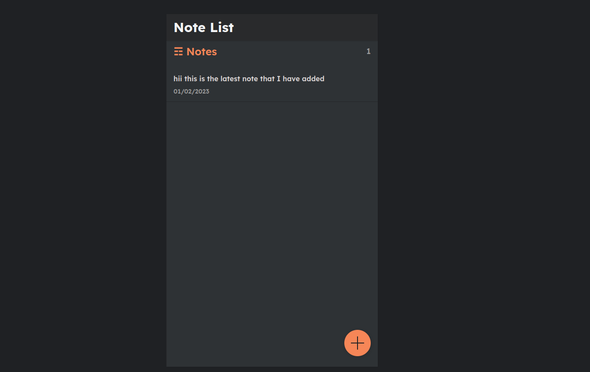

<h2 align="center">Django Note App</h2>
Preview of the application

To run the application
- install [Python](https://www.python.org/downloads/)
- install [Django](https://docs.djangoproject.com/en/4.1/topics/install/)
- install [Django rest framework](https://www.django-rest-framework.org/)
- run the cmd in the root directory `python3 manage.py runserver`, then you can see your app running in local port 8000.